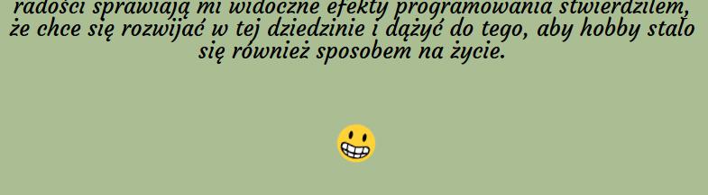
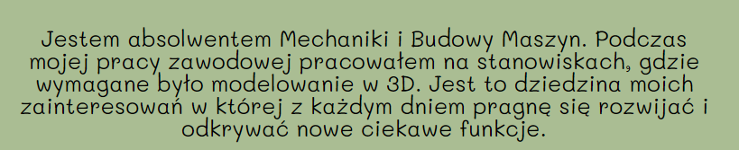
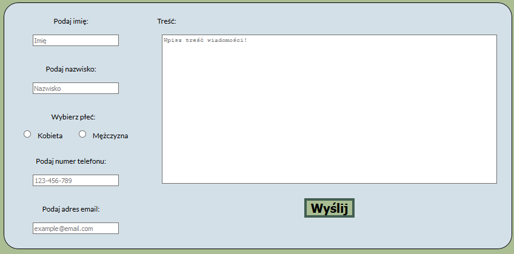
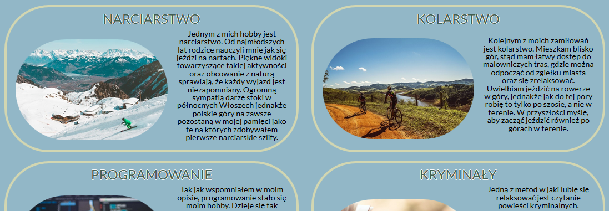

# CODERS CAMP - PROJEKT 1
* Wizytówka (HTML + CSS)
* Użycie tylko HTML i CSS. Bez JavaScript

## Użyte technologie:
1. HTML
2. CSS

## LINK DO DZIAŁAJĄCEJ STRONY:
[Moja wizytówka](https://sebastianjajesnica.github.io/BusinessCard/ "Sebastian Jajeśnica - Wizytówka")

## Treść strony:
* Strona przedstawia moją sylwetkę, tj. Sebastiana Jajeśnicy, uczestnika otwartego kursu programowania webowego CodersCamp. Jest to swoiste CV, gdzie zamieściłem wszelkie informacje na temat mojej osoby. Można tam też znaleźć odnośniki do profili społecznościowych, gdzie można mnie znaleźć. 

* Pozdrawiam i zachęcam do przeglądania storny i kontaktu z moją osobą ! :) 

## Zrealizowane założenia w projekcie:
* Box-model
* Kaskadowość 
* Selektory CSS 
* Popularne tagi HTML
* Podpinanie CSS'a do HTMLa
* Zapisywanie kolorów
* Stylowanie tekstu
* Zewnętrzne ikony/fonty
* Flexbox 
* Position (absolute, relative)
* Animacje keyframes
* Formularz
* Responsive Web Designe

### Przykładowe miejsca realizacji założeń:
* Animacje keyframes - obracający się uśmiech:
    

* Zewnętrzny font:
    

* Formularz:
    

* Użycie flexboxa:
    

### Użyte czcionki: 
1. [Font Lato](https://fonts.google.com/specimen/Lato?query=lato "Font Lato")
2. [Font Courgette](https://fonts.google.com/specimen/Courgette?query=Courgette "Font Courgette")
2. [Font Awesome Brand Icons](https://www.w3schools.com/icons/fontawesome_icons_brand.asp "Font Awesome Brand Icons")

### Użyte zdjęcia:
1. Darmowa licencja - Iconfinder:
    * [Użyta ikona](https://www.iconfinder.com/icons/4288584/and_business_finance_personal_portfolio_profile_resume_icon "Logo")
    
2. Darmowa licencja - Pexels :
    * [Hero](https://www.pexels.com/pl-pl/zdjecie/metal-chrome-moc-zelazo-190574/ "Hero")
    * [Skiing](https://www.pexels.com/pl-pl/zdjecie/przeziebienie-snieg-krajobraz-gory-352093/   "Skiing")
    * [Cycling](https://www.pexels.com/pl-pl/zdjecie/droga-polna-gleba-gory-jazda-163407/ "Cycling")
    * [Programming](https://www.pexels.com/pl-pl/zdjecie/ai-dane-deweloper-ekran-577585/ "Programming")
    * [Crime Novels](https://www.pexels.com/pl-pl/zdjecie/encyklopedia-literatura-powiesc-rozmazany-46274/ "Crime Novels")